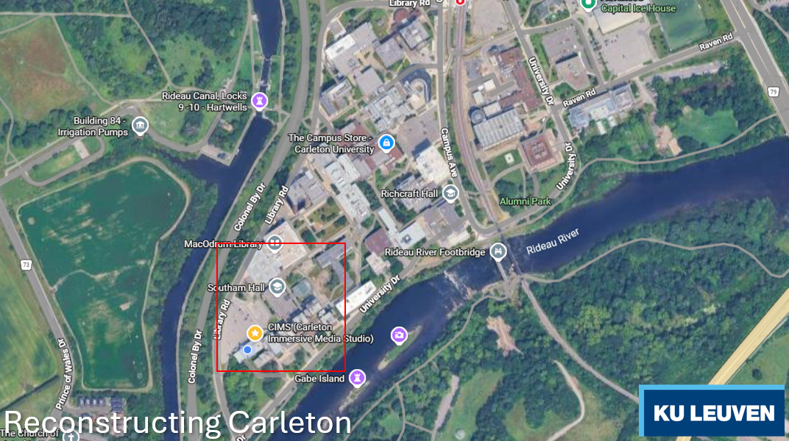
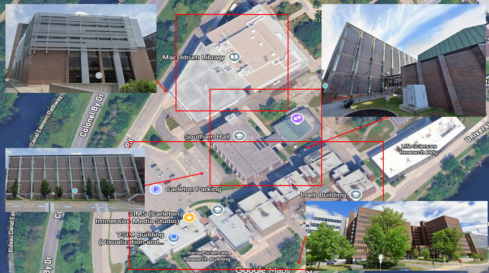
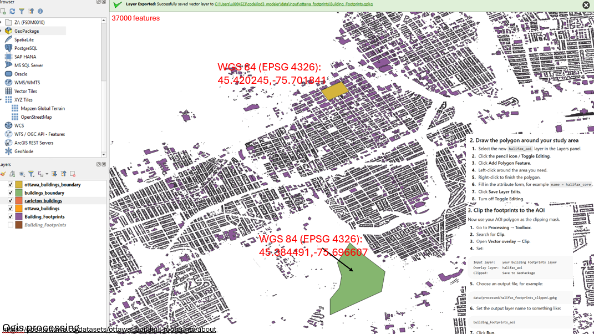
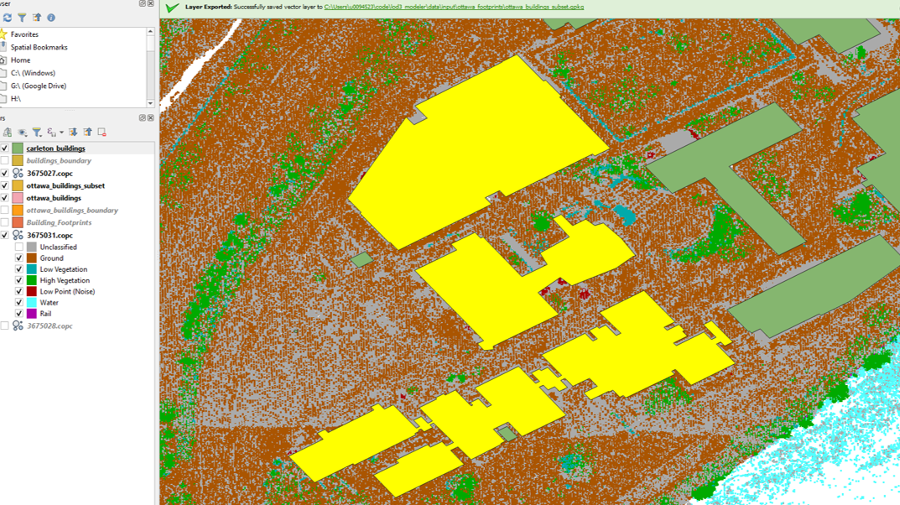
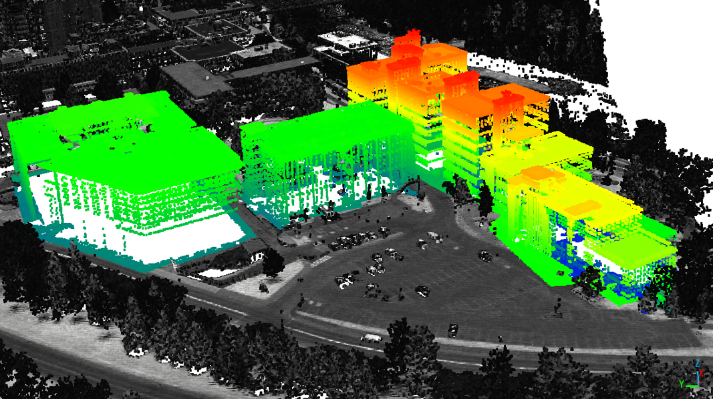
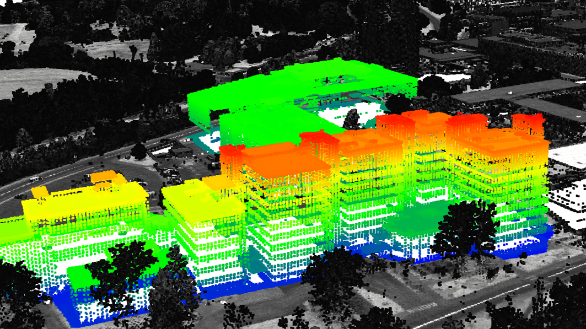
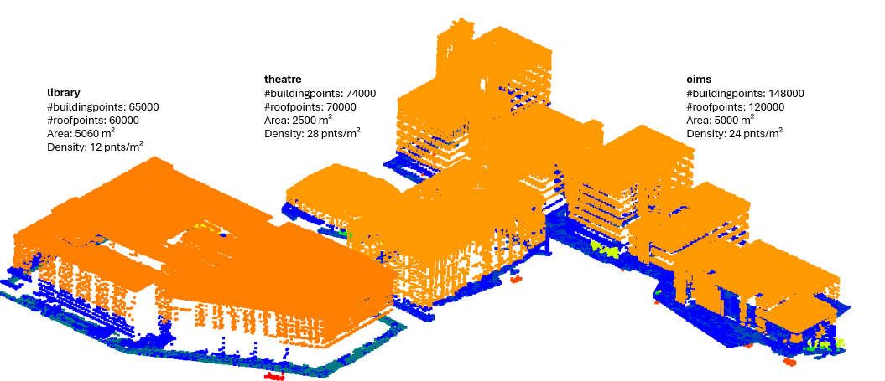
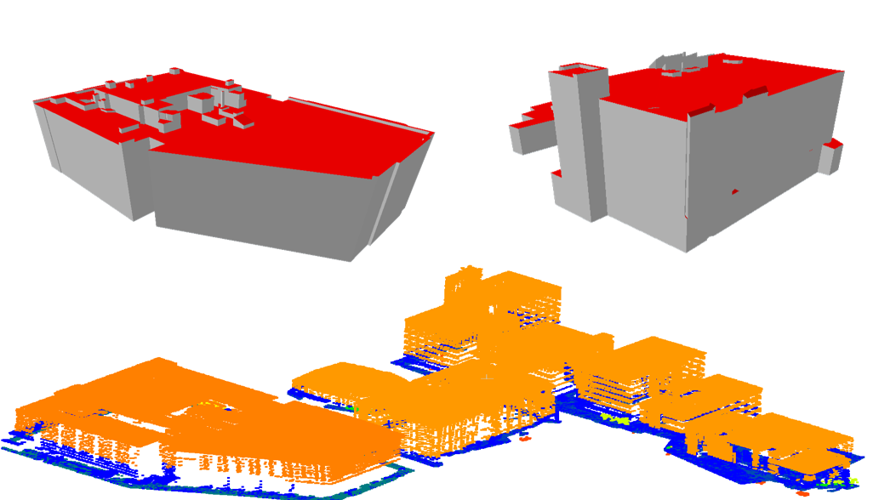
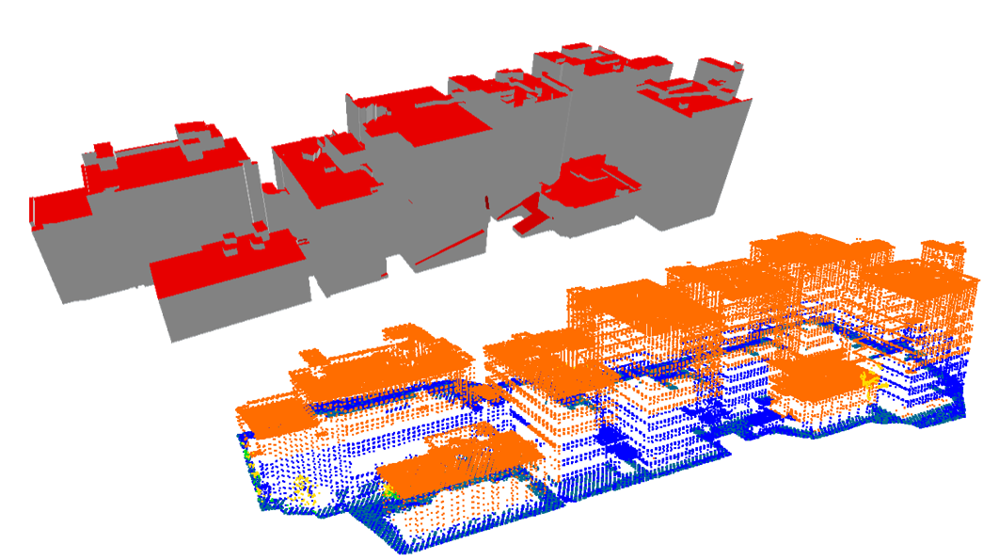

# Carleton Proof-of-Concept Workflow

This document records the current proof of concept for reconstructing LoD2 buildings on the Carleton University campus. The current scope is LoD2 reconstruction from building footprints and airborne LiDAR. LoD3 enrichment and panelization are planned next steps.

## Study Area

The proof of concept focuses on the campus block around MacOdrum Library, Southam Hall/theatre, and the Carleton Immersive Media Studio.



The detailed working area is shown below.



Two WGS84 coordinates were used to anchor the local campus area:

```text
45.384491, -75.696607
45.420245, -75.701841
```



## 1. Building Footprints

Building footprints were taken from the City of Ottawa open data portal:

```text
https://open.ottawa.ca/datasets/ottawa::building-footprints/about
```

The source layer contains roughly 37,000 features. The workflow used QGIS to:

1. Load the Ottawa building footprint layer.
2. Select the Carleton campus area around the proof-of-concept coordinates.
3. Export the selected buildings into project-local GeoPackage files.
4. Split the proof-of-concept buildings into individual footprint files for Geoflow.

Local footprint inputs are stored in:

```text
data/input/carleton_footprints/
```

The important working files are:

```text
carleton_buildings.gpkg
carleton_buildings_subset.gpkg
carleton_buildings_subset_18.gpkg
library.gpkg
theatre.gpkg
cims.gpkg
```



The current Geoflow LoD2 workflow is run per building, so the individual `library.gpkg`, `theatre.gpkg`, and `cims.gpkg` files are the practical reconstruction inputs.

## 2. LiDAR Tile Selection

The point clouds come from the Natural Resources Canada CanElevation LiDAR point-cloud product:

```text
https://natural-resources.canada.ca/science-data/science-research/geomatics/new-lidar-point-clouds-product-canada-you-ve-never-seen
```

CanElevation tiles were found from the public tile index and downloaded from:

```text
s3://canelevation-lidar-point-clouds/pointclouds_nuagespoints/
```

AWS CLI commands against this public bucket require `--no-sign-request`.

The Carleton proof of concept uses the Ottawa/Gatineau 2020 tiles from:

```text
VILLE_OTTAWA/Ottawa_Gatineau_2020/
```

The point-cloud CRS for these tiles is:

```text
EPSG:2959
NAD83(CSRS) / MTM zone 9
```

Candidate campus coordinates used during tile selection included:

```text
tower1:  45.4204362, -75.7021832
tower2a: 45.4204362, -75.7021832
tower2b: 45.4204362, -75.7021832
```

The proof-of-concept tile manifest is:

```text
data/input/carleton_lidar/carleton_candidate_tiles.csv
```

The downloaded source tiles are:

```text
3675031.copc.laz
3675028.copc.laz
3675027.copc.laz
```

`3675027.copc.laz` was added after checking the tile immediately south of `3675028`.





## 3. LiDAR Processing

The reconstruction needs point clouds with building points classified as ASPRS class `6`.

During the proof of concept, the downloaded COPC LAZ tiles were clipped/processed to the Carleton buildings and written to:

```text
data/input/carleton_lidar/carleton_buildings.las
```

The working point-cloud file contains the selected building samples with a populated `Classification` field. The current samples are:

```text
library
  building points: 65,000
  roof points:     60,000
  area:            5,060 m2
  density:         12 points/m2

theatre
  building points: 74,000
  roof points:     70,000
  area:            2,500 m2
  density:         28 points/m2

cims
  building points: 148,000
  roof points:     120,000
  area:            5,000 m2
  density:         24 points/m2
```



## 4. LoD2 Reconstruction

LoD2 reconstruction uses TU Delft Geoflow and the repo-local patched reconstruction flowchart:

```text
https://github.com/geoflow3d/geoflow-bundle.git
https://github.com/Saiga1105/roofer.git
flowcharts/reconstruct.json
```

Use the local flowchart instead of relying on Geoflow's automatic flowchart selection. The local copy removes unsupported metadata parameters and exposes explicit output paths for the LoD1.2, LoD1.3, and LoD2.2 OBJ files.

Run commands from the repository root. Example for the library:

```powershell
lod22-reconstruct `
  --flowchart=flowcharts/reconstruct.json `
  --input_footprint=data/input/carleton_footprints/library.gpkg `
  --input_footprint_select_sql= `
  --input_pointcloud=data/input/carleton_lidar/carleton_buildings.las `
  --output_cityjson=data/output/carleton/library.json `
  --output_obj_lod12=data/output/carleton/library_lod12.obj `
  --output_obj_lod13=data/output/carleton/library_lod13.obj `
  --output_obj_lod22=data/output/carleton/library.obj `
  --output_cj_referenceSystem=urn:ogc:def:crs:EPSG::2959 `
  --output_ogr_EPSG=2959
```

Equivalent commands were run for:

```text
data/input/carleton_footprints/theatre.gpkg
data/input/carleton_footprints/cims.gpkg
```

Current local outputs are:

```text
data/output/carleton/library.json
data/output/carleton/library.obj
data/output/carleton/theatre.json
data/output/carleton/theatre.obj
data/output/carleton/cims.json
data/output/carleton/cims.obj
```

These generated outputs are intentionally kept out of Git.





## 5. Current Limitations

The proof of concept is successful for LoD2, but the workflow still needs hardening before broader production use:

1. Building class `6` must be available consistently in the point clouds. A DALES-trained PointTransfer workflow needs to be adapted for this.
2. LoD2 reconstruction currently consumes individual GeoPackage files. Batch processing is still needed.
3. Geoflow/Roofer reconstruction parameters need systematic tuning for the Carleton sample buildings.
4. Geolocated close-range imagery of high-rise facades is still missing and will likely need to be purchased.
5. LoD3 enrichment must be adapted to the new inputs, including XMP/XML geolocation metadata.
6. Panelization does not yet consider structural constraints. Clear engineering examples are needed before the next implementation pass.

## Next Step

The next phase is LoD3 reconstruction and enrichment using this LoD2 proof of concept as the geometric base.
